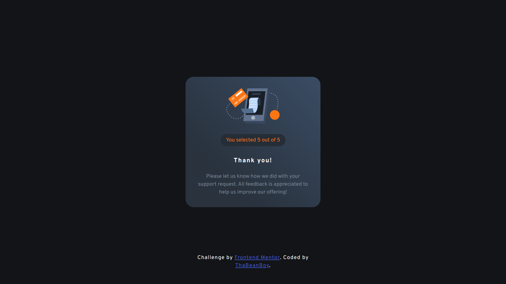

# Frontend Mentor - Interactive rating component solution

This is a solution to the [Interactive rating component challenge on Frontend Mentor](https://www.frontendmentor.io/challenges/interactive-rating-component-koxpeBUmI). Frontend Mentor challenges help you improve your coding skills by building realistic projects.

## Table of contents

- [Frontend Mentor - Interactive rating component solution](#frontend-mentor---interactive-rating-component-solution)
  - [Table of contents](#table-of-contents)
  - [Overview](#overview)
    - [The challenge](#the-challenge)
    - [Screenshot](#screenshot)
    - [Links](#links)
  - [My process](#my-process)
    - [Built with](#built-with)
    - [What I learned](#what-i-learned)
    - [Continued development](#continued-development)
    - [Useful resources](#useful-resources)
  - [Author](#author)
  - [Acknowledgments](#acknowledgments)

## Overview

### The challenge

Users should be able to:

- View the optimal layout for the app depending on their device's screen size
- See hover states for all interactive elements on the page
- Select and submit a number rating
- See the "Thank you" card state after submitting a rating

### Screenshot




### Links

- Solution URL: [Add solution URL here](https://your-solution-url.com)
- Live Site URL: [Add live site URL here](https://your-live-site-url.com)

## My process

### Built with

- Semantic HTML5 markup
- CSS custom properties
- Flexbox
- CSS Grid
- Mobile-first workflow
- [React](https://reactjs.org/) - JS library
- [Next.js](https://nextjs.org/) - React framework
- [Styled Components](https://styled-components.com/) - For styles

**Note: These are just examples. Delete this note and replace the list above with your own choices**

### What I learned

- I had to open up figma and measure the designs so that the html and css properly reflects the design
- An interesting thing, I had to figure out the letter spacing & line-height of the typography in the design

  ```css
  typographic-element {
    line-height: 24px;
    letter-spacing: 2px;
  }
  ```

- I made use of data-attributes so that the css can idenify the active index button

  ```html
  <span class="slideChanger" data-index-active>1</span>
  ```

  ```css
  .slideChanger[data-index-active] {
    background-color: var(--Light-Grey);
    color: var(--white);
  }
  ```

- A cool thing I did, when hovering over a slide changer button, if the button is an active, the hover effects don't render, weheras if it's not active, the hover effects take place

  ```css
  .slideChanger:hover:not([data-index-active]) {
    background-color: var(--primary-orange);
    color: var(--white);
    transition: 0.5s;
  }
  ```

- The rating box background color was a bit of a problem figuring out. I noticed that it was a gradient, but I was not completely sure what type of a gradient it is and what colors to use. I ended up using [Coolor's gradient maker](https://coolors.co/gradient-maker/29323d-3a4b62?position=25,100&opacity=100,100&type=linear&rotation=45), and this is what I ended using in the css

  ```css
  gradient-css-properties {
    background: hsla(213, 20%, 20%, 1);

    background: linear-gradient(
      45deg,
      hsla(213, 20%, 20%, 1) 25%,
      hsla(215, 26%, 31%, 1) 100%
    );

    background: -moz-linear-gradient(
      45deg,
      hsla(213, 20%, 20%, 1) 25%,
      hsla(215, 26%, 31%, 1) 100%
    );

    background: -webkit-linear-gradient(
      45deg,
      hsla(213, 20%, 20%, 1) 25%,
      hsla(215, 26%, 31%, 1) 100%
    );
    padding: 34px;
    border-radius: 25px;
  }
  ```

### Continued development

Use this section to outline areas that you want to continue focusing on in future projects. These could be concepts you're still not completely comfortable with or techniques you found useful that you want to refine and perfect.

**Note: Delete this note and the content within this section and replace with your own plans for continued development.**

### Useful resources

- [Example resource 1](https://www.example.com) - This helped me for XYZ reason. I really liked this pattern and will use it going forward.
- [Example resource 2](https://www.example.com) - This is an amazing article which helped me finally understand XYZ. I'd recommend it to anyone still learning this concept.

**Note: Delete this note and replace the list above with resources that helped you during the challenge. These could come in handy for anyone viewing your solution or for yourself when you look back on this project in the future.**

## Author

- Website - [Add your name here](https://www.your-site.com)
- Frontend Mentor - [@yourusername](https://www.frontendmentor.io/profile/yourusername)
- Twitter - [@yourusername](https://www.twitter.com/yourusername)

**Note: Delete this note and add/remove/edit lines above based on what links you'd like to share.**

## Acknowledgments

This is where you can give a hat tip to anyone who helped you out on this project. Perhaps you worked in a team or got some inspiration from someone else's solution. This is the perfect place to give them some credit.

**Note: Delete this note and edit this section's content as necessary. If you completed this challenge by yourself, feel free to delete this section entirely.**
