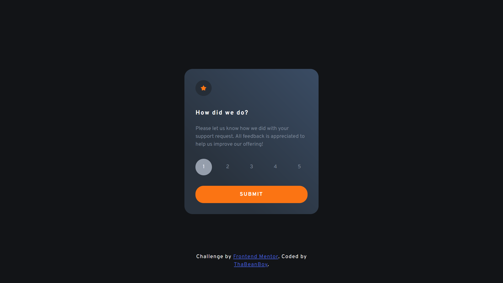
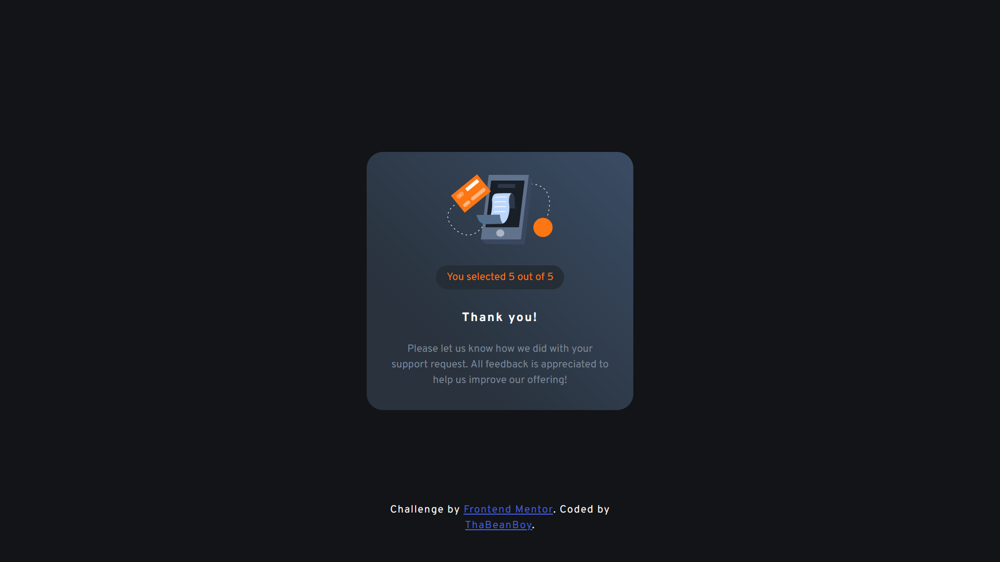

# Frontend Mentor - Interactive rating component solution

This is a solution to the [Interactive rating component challenge on Frontend Mentor](https://www.frontendmentor.io/challenges/interactive-rating-component-koxpeBUmI). Frontend Mentor challenges help you improve your coding skills by building realistic projects.

## Table of contents

- [Frontend Mentor - Interactive rating component solution](#frontend-mentor---interactive-rating-component-solution)
  - [Table of contents](#table-of-contents)
  - [Overview](#overview)
    - [The challenge](#the-challenge)
    - [Screenshot](#screenshot)
    - [Links](#links)
  - [My process](#my-process)
    - [Built with](#built-with)
    - [What I learned](#what-i-learned)
    - [Useful resources](#useful-resources)
  - [Author](#author)

## Overview

### The challenge

Users should be able to:

- View the optimal layout for the app depending on their device's screen size
- See hover states for all interactive elements on the page
- Select and submit a number rating
- See the "Thank you" card state after submitting a rating

### Screenshot




### Links

- Solution URL: [Github repo](https://github.com/ThaBeanBoy/Front-End-Mentor-Interactive-Rating-Component.git)
- Live Site URL: [live site](https://thabeanboy.github.io/Front-End-Mentor-Interactive-Rating-Component/)

## My process

### Built with

- HTML5
- Flexbox
- Desktop-first workflow
- [SCSS](https://sass-lang.com/)
- [Coolors gradient maker](https://coolors.co/gradient-maker)

### What I learned

- I had to open up figma and measure the designs so that the html and css properly reflects the design
- An interesting thing, I had to figure out the letter spacing & line-height of the typography in the design

  ```css
  typographic-element {
    line-height: 24px;
    letter-spacing: 2px;
  }
  ```

- I made use of data-attributes so that the css can idenify the active index button

  ```html
  <span class="slideChanger" data-index-active>1</span>
  ```

  ```css
  .slideChanger[data-index-active] {
    background-color: var(--Light-Grey);
    color: var(--white);
  }
  ```

- A cool thing I did, when hovering over a slide changer button, if the button is an active, the hover effects don't render, weheras if it's not active, the hover effects take place

  ```css
  .slideChanger:hover:not([data-index-active]) {
    background-color: var(--primary-orange);
    color: var(--white);
    transition: 0.5s;
  }
  ```

- The rating box background color was a bit of a problem figuring out. I noticed that it was a gradient, but I was not completely sure what type of a gradient it is and what colors to use. I ended up using [Coolor's gradient maker](https://coolors.co/gradient-maker/29323d-3a4b62?position=25,100&opacity=100,100&type=linear&rotation=45), and this is what I ended using in the css

  ```css
  gradient-css-properties {
    background: hsla(213, 20%, 20%, 1);

    background: linear-gradient(
      45deg,
      hsla(213, 20%, 20%, 1) 25%,
      hsla(215, 26%, 31%, 1) 100%
    );

    background: -moz-linear-gradient(
      45deg,
      hsla(213, 20%, 20%, 1) 25%,
      hsla(215, 26%, 31%, 1) 100%
    );

    background: -webkit-linear-gradient(
      45deg,
      hsla(213, 20%, 20%, 1) 25%,
      hsla(215, 26%, 31%, 1) 100%
    );
    padding: 34px;
    border-radius: 25px;
  }
  ```

### Useful resources

- [Coolors gradient maker](https://www.example.com) - This helped me make the gradient for the "thank you" and the rating box.
- [SCSS](https://sass-lang.com/) - This helped me break my code apart into different files. It made CSS far easier to use and read in my opinion.

## Author

- Website - [Add your name here](https://github.com/ThaBeanBoy)
- Frontend Mentor - [@yourusername](https://www.frontendmentor.io/profile/yourusername)
- Instagram - [@tiin_giib_chiip](https://www.instagram.com/tiin_giib_chiip/)
